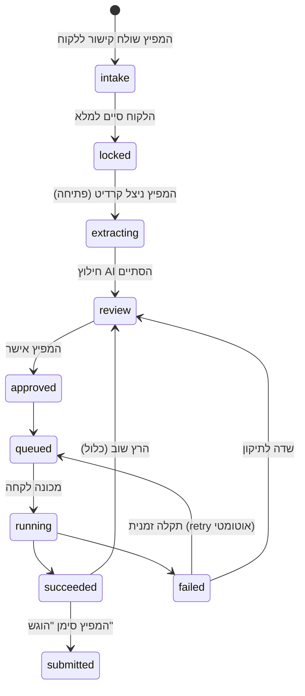

# PassFlow - תכנון פלטפורמת SaaS (המשך קדימה מעבר לבוט הפנימי)

מסמך זה מסכם דיון תכנוני (החל מ-2026-09-01) על הפיכת הבוט הפנימי של
American Docs (מתועד ב-`CLAUDE.md`) למוצר/שירות שנמכר לעסקי סוכנויות
דרכונים אחרים ("מפיצים"). **עדכון 2026-09-14: חלק אחד מהתכנון (הרצה
מרחוק על מכונת VPS, ראו סעיף ייעודי למטה) כבר יצא לפועל וחי בפרודקשן** -
המשך התכנון (מודל עסקי, תמחור, יסודות-אבטחה, שכבות self-service) עדיין
ברמת דיון בלבד. לתיעוד הבוט הקיים והפועל בפועל, וגם לפרטי ההרצה-מרחוק
המלאים - ראה `CLAUDE.md` ו-`notes.md` באותה תיקייה.

## למה בכלל

הבוט הקיים עובד מצוין ל-American Docs עצמה, אבל כל תקלה (יש הרבה, ראה
היסטוריית `CLAUDE.md`) מתוקנת ידנית ע"י בעל העסק. השאלה שהניעה את הדיון:
איך הופכים את זה למוצר שאפשר למכור לעסקים אחרים בלי שכל תקלה אצל לקוח
תדרוש התערבות אישית.

## מודל עסקי שהוחלט (כיוון, לא סופי)

> **עדכון 2026-09-14**: הסעיף הזה היסטורי. בפועל הוחלט לבנות **פלטפורמה
> מלאה** (שאלון ממותג, מסך בדיקה, חיוב בקרדיטים), והתמחור הוא בשקלים - ראו
> "חישוב כלכלי ראשוני" ו"מחזור חיים של תיק" למטה.

**שירות/API, לא פלטפורמה** - למפיץ (=מי שקונה את השירות, יש לו כבר לקוחות-קצה
משלו) יש כבר Fillout/Zoho/Drive משלו. הפתרון: שירות שמעבד תיקים ומחזיר DS-11
מוכן, לא פלטפורמה שהמפיץ צריך לנטוש את הכלים שלו כדי לעבוד דרכה.

**למה זה עדיף** (הוחלט אחרי שיקול מפורש):
- פחות חיכוך מכירה - המפיץ לא צריך לזרוק את מה שכבר יש לו
- פחות סיכון שכפול - אין "פלטפורמה" עם UI שאפשר להעתיק; הערך הוא בעיבוד
  עצמו, לא בממשק

**תמחור**: כיוון של **תשלום לפי מקרה** (~4$ למועמד הוזכר כמספר לדוגמה,
לא סופי). זה מחיר דק - קובע דרישת ארכיטקטורה קריטית: כמעט כל טיפול בתקלה
**חייב** להיות self-service (ראה סעיף "שכבות הגנה" למטה), כי מגע אנושי
אמיתי של תמיכה כבר אוכל חלק ניכר מהרווח של מקרה בודד. יעד גס: פחות מ-5-10%
מהמקרים יגיעו בכלל לבן אדם.

## הזרימה שהוחלט עליה - שני שלבים

1. **שאלון קליטה מאוחד** (מחליף את הפיצול הקיים היום בין טופס Fillout
   לתיקיית Drive) - ניתן למיתוג ע"י המפיץ, נשלח ללקוח-הקצה שלו. המידע
   נכנס לטבלת בדיקה (כמו ה-Google Sheet היום, או מנגנון מקביל).
2. **בדיקה ואישור ע"י המפיץ** - המפיץ רואה את המידע שנקלט, מאשר, מריץ
   מילוי DS-11. אם התוצאה לא טובה לו - יכול לשלוח שוב למילוי (regenerate),
   לא רק לפתוח קריאת תמיכה.

## "יסודות" - החלטות שצריך לקבוע *לפני* כתיבת קוד (יקר לשנות בדיעבד)

בשונה מעיצוב מסך/UX שזול לשנות תוך כדי, אלה משפיעים על נתונים חיים ברגע
שיש בהם PII של לקוחות אמיתיים:

- **איפה מסמכים נשמרים** - לא Drive כמו היום (זה התאים ל-American Docs עם
  חשבון אחד; מוצר multi-tenant צריך אחסון עם בידוד הרשאות אמיתי ברמת
  אובייקט - למשל GCS עם ACL/מדיניות לפי tenant, לא תיקיות משותפות)
- **בידוד מפיצים** (tenant isolation) - קובע גם את מבנה מסד הנתונים
- **הצפנה** - at rest ו-in transit, ומי מחזיק את המפתחות
- **מדיניות שמירה/מחיקה** - כמה זמן שומרים סריקת דרכון/SSN אחרי שהתיק
  נסגר (גם עניין משפטי, לא רק טכני)
- **לוג ביקורת** - מי צפה/הוריד איזה מסמך ומתי

### הצעה ראשונה ליסודות (2026-09-14) - ממתינה להחלטות המשתמש

הנחת עבודה: להישאר על GCP, `me-west1` (תל אביב) - התשתית הקיימת כבר שם,
והנתונים נשארים בישראל.

- **מסד נתונים**: Cloud SQL Postgres אחד, עמודת `tenant_id` בכל טבלה +
  **Row-Level Security** של Postgres - כך שגם באג בשאילתה לא יחזיר נתונים
  של מפיץ אחר. לא מסד נפרד לכל מפיץ (מיותר בנפח הזה).
- **אחסון מסמכים**: באקט GCS פרטי אחד, נתיבים `tenants/{tenant_id}/cases/{case_id}/...`.
  אף אחד (מפיץ, לקוח-קצה, מכונת worker) לא ניגש לבאקט ישירות - השרת
  בודק הרשאה ומנפיק **signed URL קצר-מועד** (5-15 דק') להעלאה/הורדה.
- **הצפנה**: at rest ו-in transit ברירת מחדל של Google (מוצפן תמיד). בנוסף
  **הצפנה ברמת האפליקציה ל-SSN** (Cloud KMS) - גם מי שיש לו גישה למסד לא
  רואה אותו בטקסט גלוי. CMEK מלא לכל הבאקט - לא בשלב הראשון.
- **מכונות worker**: במקום לקרוא שיטס, מושכות עבודה מה-API עם טוקן-מכונה,
  מקבלות רק את נתוני התיק הנדרשים, מעלות את ה-PDF דרך signed URL, ו**מוחקות
  כל קובץ מקומי** בסוף ההרצה (היום נשארים `downloaded_pdfs/`/debug על הדיסק).
- **מדיניות שמירה**: 90 יום + הארכה בתשלום (ראו סעיף התמחור). מחיקה ע"י job
  מתוזמן לפי תאריך התוקף של כל לקוח. כלל lifecycle קשיח בבאקט לא מתאים
  כמו שהוא (לקוחות מוארכים חיים יותר) - במקום זה: job יומי שמתריע אם נשאר
  אובייקט של לקוח שפג תוקפו.
- **לוג ביקורת**: טבלה append-only - מי, איזה מפיץ, מה (צפייה/הורדה/עריכה/
  אישור/הרצה/מחיקה), איזה אובייקט, מתי, IP. כל הורדה עוברת דרך הנפקת signed
  URL ולכן נרשמת. גישה של מנהל הפלטפורמה (American Docs) לתיק של מפיץ לצורך
  תמיכה - מותרת אבל **נרשמת ומוצגת למפיץ**.
- **משתמשים**: עובדי מפיץ - חשבון עם 2FA (Identity Platform/Firebase Auth),
  תפקידים owner/staff. לקוח-קצה - **בלי חשבון**, קישור ייחודי לתיק שפג תוקף.
- **משפטי** (לא טכני, לבדוק מול עו"ד): תיקון 13 לחוק הגנת הפרטיות ותקנות
  אבטחת מידע; הנתונים עוברים גם ל-Anthropic (ארה"ב) לחילוץ - צריך להופיע
  בתנאי השימוש מול המפיצים.

## מחזור חיים של תיק ומודל נתונים (טיוטה 2026-09-14)

### החלטות המשתמש
- המצבים שהוצעו (קליטה -> בדיקה -> אישור -> תור -> ריצה -> הצלחה/כישלון ->
  נשמר/נמחק) - **מאושרים**.
- **חיוב ברמת חשבון המפיץ** - יתרת קרדיטים (3 חינם בהרשמה + חבילות).
- **הטופס חינם לאיסוף מידע**, אבל **אין ייצוא ואין הרצה** של שום דבר עד
  שהמפיץ מנצל קרדיט על המועמד ("פתיחה"). אם אין יתרה - קונה חבילה.
- **מסך המועמד**: תצוגה ויזואלית יפה וברורה, **כפתור העתקה ליד כל שדה**,
  ו**בלוק ייעודי לתשלום (pay.gov)**. שובר דואר שליחים - **רק קישור** לאתר הדואר
  (הוחלט 2026-09-14), בלי בלוק שדות. המטרה: שהמפיץ יבצע משם בנוחות גם את שאר השלבים (לא רק
  DS-11).

### שני צירים נפרדים
מצב העבודה ומצב השמירה בלתי תלויים (מועמד יכול להיות "הצליח" וגם "נשמר
בתשלום"), לכן שני שדות נפרדים ולא רשימת מצבים אחת.

**ציר עבודה (לכל בקשה):**

- `locked` = המידע נאסף אבל נעול: אין צפייה בערכים, אין העתקה, אין ייצוא,
  אין הרצה (הצעה - ראו שאלות פתוחות).
- כישלון מסוג "פנה לתמיכה" נשאר ב-`failed` עד טיפול ידני.

**ציר שמירה (לכל אדם):** `active` (90 יום מהפתיחה) -> `retained` (3 ₪ לחודש)
או `deleted` (נשארת רשומת מעקב מינימלית). מפיץ יכול להעביר ל-`deleted` בכל שלב.
תיק שמעולם לא נפתח נמחק 90 יום מיצירתו.

### מודל נתונים (טבלאות עיקריות)
הכל עם `tenant_id` + Row-Level Security.

| טבלה | מה יש בה |
|---|---|
| `tenants` | עסק המפיץ: שם, ח.פ./עוסק, טלפון מאומת, מיתוג (לוגו/צבע לטופס) |
| `users` | עובדי מפיץ: אימייל, תפקיד owner/staff, 2FA |
| `intakes` | קישור טופס אחד למשפחה: טוקן, תוקף, מצב. משפחה = intake אחד, כמה מועמדים |
| `documents` | קבצים שהועלו: סוג (מסווג AI), נתיב מוצפן, שיוך למועמד |
| `persons` | האדם: שם+תאריך לידה **ננעלים בפתיחה**, HMAC זהות, מצב שמירה, `retained_until` |
| `applications` | בקשה אחת (DS-11/DS-82/DS-5504): מצב עבודה, `unlocked_at`, `submitted_at`, `parent_application_id` (להחלפה ל-DS-5504) |
| `application_data` | ערכי השדות (מוצפן), דגלי "ביטחון נמוך", **גרסאות** - כל עריכה נשמרת |
| `runs` | כל הרצה: מכונה, זמנים, תוצאה, קטגוריית שגיאה, שדה, קבצי דיבאג |
| `workers` | מכונות: טוקן (hash), נראה לאחרונה, עסוק/פנוי |
| `credit_ledger` | **append-only**: +3 הרשמה / +10 רכישה / -1 פתיחה / +1 החזר. יתרה = סכום |
| `payments` | חשבונית ירוקה: סכום, מע"מ, מספר חשבונית, חבילה, מצב |
| `retention_charges` | חיוב חודשי מרוכז לשמירה, לכל מפיץ |
| `audit_log` | append-only: צפייה/העתקה/ייצוא/עריכה/הרצה/מחיקה/כניסת תמיכה |

### עריכת פרטי מועמד (2026-09-14)
- המפיץ עורך כל שדה במסך המועמד (עיפרון ליד השדה). שדות מרשימה סגורה (מין,
  שיער, עיניים, גובה, כן/לא) = תפריט בחירה עם הערכים מ-`build_sheet.py`. שדות
  עם פורמט (תאריך, אימייל, טלפון, SSN) = ולידציה לפני שמירה.
- עריכה נשמרת כגרסה ב-`application_data` ונרשמת בהיסטוריה. עריכה בשדה משותף
  מתעדכנת אצל כל האחים, אלא אם הבלוק נותק.
- עריכה אחרי הצלחה -> המועמד חוזר ל"לבדיקה" + "אשר והרץ שוב" (כלול במחיר).
- **הוחלט (2026-09-14)**: שם+תאריך לידה ניתנים לעריכה **עד ההרצה המוצלחת
  הראשונה** (כדי לתקן טעויות חילוץ), ורק אז ננעלים לתמיד. אחרי הנעילה -
  תיקון דרך תמיכה בלבד.

### שאלות מפתח וסוג הטופס (2026-09-14)
- בראש מסך המועמד: **מצב הדרכון** (פעם ראשונה / יש ביד / פגום / אבד / נגנב),
  תאריך לידה, תאריך הנפקת הדרכון הקודם, תוקף מוגבל, שינוי שם + מסמך מאושר.
- **סוג הטופס מחושב אוטומטית** (DS-11 / DS-82 / DS-5504) עם הסיבות, לפי אותם
  כללים של `build_google_sheet_template.py` - **כולל** תוקף מוגבל, שחסר היום
  בנוסחת השיטס (הפער המתועד ב-CLAUDE.md).
- שינוי תשובה **מציג/מסתיר מקטעים** (הדרכון הקודם, דיווח אבדה/גניבה DS-64,
  הורים רק ל-DS-11), ומסמן **שדות חובה חסרים**. אי אפשר להריץ עד שכולם מולאו.
- שינוי סוג טופס אחרי פתיחה = אותו קרדיט.
- הלוגיקה צריכה לשבת **בשרת** (מקור אמת אחד לשיטס, למסך ולבוט), לא רק בדפדפן.

### מילוי אוטומטי באתרים חיצוניים (תשלום, שליחים) - הצעה (2026-09-14)
בקשת המשתמש: לחיצה על קישור מהדשבורד (למשל עמוד התשלום) תמלא שם את השדות
אוטומטית מנתוני המועמד.
- **קישור רגיל לא יכול** - הדפדפן חוסם דף אחד מלגעת בשדות של אתר אחר
  (same-origin policy). פרמטרים בכתובת עובדים רק אם האתר היעד תומך בזה,
  ואתרי ממשל/תשלום כמעט אף פעם לא.
- **הפתרון: תוסף Chrome של PassFlow** שהמפיץ מתקין (כמו מנהל סיסמאות):
  - לחיצה בדשבורד פותחת את האתר עם מזהה המועמד; התוסף מושך את הנתונים מה-API
    (מחובר כמשתמש המפיץ, טוקן קצר-מועד) וממלא את השדות.
  - **שתי שכבות**: (1) **פאנל צד** על כל אתר עם השדות וכפתורי העתקה - עובד גם
    כשהאתר משתנה; (2) **מילוי בלחיצה** לאתרים מוכרים - דורש תחזוקת selectors,
    כמו הבוט.
  - המפיץ נשאר בשליטה: רואה, מתקן ולוחץ "שלם" בעצמו. **פרטי כרטיס האשראי
    לעולם לא עוברים דרכנו** (לא נוגעים ב-PCI).
  - אבטחה: הרשאות התוסף מוגבלות לדומיינים הספציפיים בלבד, לא שומר מידע מקומית,
    כל מילוי נרשם ב-`audit_log`. הפצה כתוסף לא-רשום (unlisted) בחנות Chrome.
- **חלופה זולה לשלב ראשון**: כפתורי "העתק בלוק" שכבר במוקאפ.
- **כפתורים במסך המועמד (הוחלט 2026-09-14)**: שורת "אתרים חיצוניים" בראש מסך
  המועמד - "תשלום DS-11 · pay.gov", "תשלום DS-82 · pay.gov", "שובר שליחים · דואר
  ישראל". רק כפתור התשלום שמתאים לסוג הטופס המחושב פעיל (אגרה ששולמה בטעות לא
  מוחזרת). בלוק השדות להעתקה נשאר למטה ומתחלף לפי סוג הטופס.
- **מדינה בתשלום (הוחלט 2026-09-14)**: בבלוק התשלום המדינה היא רשימה נפתחת של כל
  173 המדינות של pay.gov (אותה רשימה ב-DS-11 וב-DS-82, בלי ארה"ב - טפסים לחו"ל).
  ברירת המחדל נגזרת מ-Mail Country (ISRAEL -> `Israel, West Bank, Gaza`, אחרת התאמה
  לפי שם); אם אין התאמה - השדה מסומן כחובה עד שבוחרים. הבחירה נשמרת במקרה.
  הרשימה המלאה חולצה מהעמוד השמור של DS-11 (`<select name="data[ApplicantCountry]">`).
- **גובה (הוחלט 2026-09-14)**: רגל ואינץ' מוצגים ונערכים כשדה אחד צמוד (`5′ 4″`,
  שתי רשימות זו לצד זו), גם במסך המועמד וגם בטופס הקליטה. בשיטס/בוט נשארים שני
  עמודות Height Feet / Height Inches.
- **פתוח**: DS-5504 (האם יש בכלל תשלום).

### עבודה מול תיקיית דרייב של המוכר (אופציונלי, 2026-09-19)

**ברירת המחדל נשארת הפלטפורמה**: השאלון נשלח מהפלטפורמה, המסמכים נשמרים אצלנו,
הניתוח והמילוי אצלנו, והפלט יורד מהאתר. **אופציה לכל לקוח (toggle)**: המוכר מדביק
קישור לתיקיית דרייב ונותן הרשאה, ואז השאלון והמסמכים נקראים משם וה-DS-11 נכתב לשם.
בחירה פר-לקוח, עם ברירת מחדל לחשבון.

- **הרשאה**: OAuth עם בורר התיקיות של גוגל (scope `drive.file` - רק מה שהמוכר בחר).
- **עלויות**: אין. ה-API של דרייב חינמי, האחסון הוא על החשבון של המוכר ובמכסה שלו,
  ואימות מסך ההסכמה של גוגל ל-`drive.file` הוא תהליך חינמי (הביקורת בתשלום נדרשת רק
  ל-scopes מוגבלים כמו גישה מלאה). ההוצאה היחידה שלנו היא עותק העבודה אצלנו, שקיים
  ממילא.
  **לא** `drive.readonly`/גישה מלאה: זה scope מוגבל שדורש ביקורת אבטחה שנתית בתשלום,
  ופותח למוכר את כל הדרייב שלו מולנו.
- **מתי נמשך**: כפתור "משוך עכשיו" (לא polling), לפחות בשלב ראשון.
- **מה נשמר אצלנו**: עותק עבודה גם כשהמקור בדרייב, תחת אותו כלל מחיקה (90 יום).
- **יומן**: כל משיכה וכתיבה נרשמות - מי, מתי, איזו תיקייה, כמה קבצים.

### הגנה על הקוד/התהליך מפני העתקה (2026-09-19)

**מה באמת מגן**: לא ה-UI (אותו תמיד אפשר לחקות), אלא מה שלא יוצא מהשרת - פרומפטי
החילוץ, מיפוי האשף של pptform, כללי הזכאות, קצב האנטי-בוט, ותיקוני הבאגים שנצברו.
- **כל ההחלטות בשרת**: סוג הטופס, שדות חובה, הסימונים באתר - השרת מחזיר תוצאה, לא
  כללים. ה-client מציג בלבד. (הדמו הנוכחי הוא HTML סטטי - **בו הכל גלוי**, זו הדגמה
  ולא המוצר.)
- אין API ציבורי מתועד, אין source maps, תשובות שגיאה לא חושפות לוגיקה פנימית.
- הגבלת קצב לכל חשבון + זיהוי דפוס חריג (הרבה מועמדי-דמה, שדות אקראיים) = חשבון
  שמנסה למפות את המערכת.
- סימון מים פר-חשבון בקבצים מיוצאים, ויומן שמאפשר לזהות דליפה.
- תנאי שימוש שאוסרים במפורש הנדסה לאחור/סריקה אוטומטית.

### מניעת ניצול קרדיטים חינמיים בכמה חשבונות (הוחלט 2026-09-19)

**בלי סימן מים** - המשתמש דחה: הקרדיטים החינמיים נועדו שייהנו מהמוצר וירצו לקנות,
ופלט פגום הורס בדיוק את זה. **בלי אישור ידני** - לא רוצים חיכוך בהרשמה.

**המנגנון: אימות טלפון (OTP) בהרשמה.**
- מספר נייד ישראלי אחד = חשבון אחד שמקבל קרדיטים חינמיים. נשמר כ-hash, לא כמספר גולמי.
- מספר שכבר קיבל קרדיטים חינמיים לא יקבל שוב, גם אחרי מחיקת חשבון ופתיחתו מחדש.
- אותות תומכים לסימון חשד בלבד (לא לחסימה אוטומטית): IP, fingerprint של דפדפן,
  דומיין המייל, וקצב יצירת מועמדים.
- עלות ההדלפה נסבלת: 3 קרדיטים = כמה שקלים של API. אם יתברר ניצול בהיקף, הכלים
  הבאים הם הקטנת המתנה ל-1 או חסימת הדפוס שזוהה - לא סימן מים.

### הגנה על הצד האחורי - מה באמת צריך לשמור (חידוד 2026-09-19)

המשתמש: אין בעיה שיעתיקו את המסך. מה שאסור שיזלוג הוא **הבוט שרץ על קונטבו** ו**צינור
ניתוח המסמכים** שממלא את השיטס.

**למה זה לא חשוף היום ולא ייחשף**: שני אלה רצים רק על מכונות שלנו. הקוד נשלף מתיקיית
דרייב פרטית שלנו, והמוכר אף פעם לא מקבל אליה גישה. מה שהמוכר רואה זה קלט ופלט בלבד.
מה שאפשר להסיק מבחוץ הוא לכל היותר **כללי הזכאות** - שגם ככה מודפסים בהוראות הטפסים
של מחלקת המדינה. מה שלא ניתן להסיק: הפרומפטים, מיפוי האשף, הטיפול ב-postbacks, קצב
האנטי-בוט, וכל התיקונים שנצברו (למשל השאלה השלישית בעמוד 6).

**הסיכון האמיתי הוא גישה, לא הנדסה לאחור**:
- `service_account.json` יושב כקובץ רגיל בכמה מחשבים - לעבור לסודות מנוהלים
  (Secret Manager / ADC), ולא קובץ מפתח מקומי.
- גישת RDP למכונות ההרצה - סיסמאות אישיות, לא משותפות, והגבלת IP.
- הריפו הפרטי ב-GitHub - 2FA, ובלי שיתוף מחוץ לצוות.
- עובדות עם גישה לדרייב הקוד - להפריד בין תיקיית הקוד לתיקיות הלקוחות.
- יומן גישה לכל שליפת קוד/הרצה, כדי שדליפה תהיה ניתנת לאיתור.

#### דרכון זמני (תוקף מוגבל) - כללים (בבירור, 2026-09-14)
**מה נבדק בפועל באתר** (פירוט ב-`notes.md`, "בדיקת דרכון זמני"): האתר לא שואל על הדרכון
שלפני הזמני; שאלת "תוקף מוגבל" מופיעה רק כשהדרכון האחרון הונפק בשנתיים האחרונות; כללי
DS-11 (למשל הנפקה לפני גיל 16) גוברים על DS-5504; בצירוף "זמני שהונפק לפני 16, פחות
משנתיים" האתר מציג סכום שלילי והבוט נתקע.

**הכלל לפי השגרירות (אושר ע"י המשתמש אחרי בירור, 2026-09-15)** - דרכון בתוקף שנתיים או פחות:
0. דרכון זמני **הרוס** -> DS-11 ("Yes, but damaged"). נבדק: גם כשהזמני עוד בתוקף.
1. **עד שנה מההנפקה** -> Have Book עם פרטי הזמני, "תוקף מוגבל" = Yes -> DS-5504.
2. **יותר משנה** (כולל יותר משנתיים, שבהן האתר לא שואל) -> צריך את פרטי **הדרכון המלא הקודם**:
   - זכאי ל-DS-82 לפי כל הכללים על בסיס הדרכון הקודם -> Have Book עם **פרטי הזמני**,
     "תוקף מוגבל" = No -> DS-82. (נבדק: TEMPNO.)
   - לא זכאי -> "First-time applicant, or do not want to submit most recent passport" -> DS-11.
   - חריג: ילד / הזמני הונפק לפני גיל 16 -> Have Book עם פרטי הזמני, "תוקף מוגבל" = No ->
     האתר מוציא DS-11 לפי כלל הגיל.

**נסגר בבדיקה (2026-09-16)**: גם לילד יוצא DS-5504 בתוך השנה. מה שנראה קודם כמו באג באתר
היה שאלה שלישית בעמוד 6 שלא ענינו עליה - פירוט ב-`notes.md`. הסכום השלילי בעמוד התשלום
תקין: זיכוי על "לא שילמתי על כרטיס" שמקזז את אגרת ההגשה.

**תנאי הזכאות ל-DS-82 אחרי שעברה שנה (המשתמש, 2026-09-19)** - מסמנים "תוקף מוגבל" = No
רק אם **כל** אלה מתקיימים:
1. המועמד בן **26 ומעלה** (מתחת לזה הדרכון שלפני הזמני היה דרכון ילד או דרכון ראשון
   אחרי 16 -> DS-11).
2. הדרכון המלא שלפני הזמני היה **ל-10 שנים** ו**הונפק לפני פחות מ-15 שנה**.
3. הדרכון **ברשותו, שלם**, ובלי שינוי שם - או עם שינוי שניתן להוכיח (נישואין, בית משפט,
   משרד הפנים).

כל שאר המקרים: DS-11. איך מסמנים אותו באתר:
- אם הזמני הונפק **לפני גיל 16**, או שהמועמד מתחת ל-16 היום -> Have Book עם פרטי הזמני
  ו"תוקף מוגבל" = No; כלל הגיל של האתר מוציא DS-11 לבד, והפרטים של הזמני מודפסים בטופס.
- אחרת -> "First-time applicant, or do not want to submit most recent passport". בלי זה
  האתר יוציא DS-82 על סמך הזמני בלבד (כמו בבדיקת TEMPNO).

**שדות נדרשים בשאלון**: תאריך הנפקה ומספר של הזמני (תמיד), והאם הוא הרוס; פרטי הדרכון המלא
הקודם - תאריך הנפקה, האם ביד ושלם, שם בדרכון - נדרשים רק כשעברה שנה.

#### pay.gov - תשלום DS-11 (נבדק 2026-09-14 מעמוד שמור ב-`לינקים/`)
- התחלה: `https://www.pay.gov/public/form/start/1274042472` (הקישור `.../entry/101/...`
  הוא קישור session - לא עובד מבחוץ). DS-82: `https://www.pay.gov/public/form/start/1156527186`
  (טרם נבדק). **שליחת התשלום דורשת התחברות לחשבון pay.gov.**
- הטופס בנוי ב-**Form.io** (`name="data[...]"`). מילוי ע"י תוסף חייב להפעיל
  אירועי `input`/`change`, אחרת Form.io לא רושם את הערך.

| שדה באתר | `data[...]` | חובה | מקור אצלנו |
|---|---|---|---|
| Applicant Surname | `ApplicantSurName` | כן | Last Name |
| Applicant Given Name(s) | `ApplicantGivenName` | כן | First + Middle Name |
| Applicant Date of Birth (MM/DD/YYYY) | `sensDOB` | כן | Date of Birth |
| Applicant Mailing Address | `ApplicantAddress1` | כן | Mail Street |
| Applicant Mailing Address 2 | `ApplicantAddress2` | לא | In Care Of |
| City | `ApplicantCity` | כן | Mail City |
| Country (רשימה, 174) | `ApplicantCountry` | כן | Mail Country - **מיפוי**: `ISRAEL` -> `Israel, West Bank, Gaza` |
| State / Province | `ApplicantState` | לא | - |
| Zip Code | `ApplicantZipcode` | לא | Mail Zip |
| Applicant Email Address | `partyEmail` | כן | Email |
| Confirm Applicant Email Address | `confirmEmail` | כן | Email (חייב להיות זהה) |
| Passport Application Location | `RenewalLocation` | - | **מחושב אוטומטית** מהמדינה |
| Product you are applying for | `Product` | כן | **תמיד Book** (החלטת המשתמש) - Book (Adult) או Book (Minor) לפי הגיל. קטין = $130 לפי המשתמש |
| Amount Due | `RemittanceNetAmount` | כן | **מחושב אוטומטית** מהמוצר |

**הדינמיות** (מתוך הגדרות הטופס): שדה נסתר `Age` מחושב מ-`sensDOB`. אם
`Age < 16` רשימת המוצרים היא `Book/Card/Book & Card (Minor)`, אחרת `(Adult)`.
המחירים נטענים מהשרת של pay.gov (לא קבועים בדף), ו-`Amount Due` = המספר
שאחרי `$` בתווית המוצר. שינוי תאריך לידה **מנקה** את המוצר שנבחר. מחירי
מבוגר שנראו: Book $165, Card $65, Book & Card $195. מחירי קטין לא נראו בעמוד
השמור. **זרימה (המשתמש)**: התוסף ממלא, המפיץ ממשיך ומשלם בעצמו - אנחנו לא
משלמים. **מסקנה**: לא לקודד מחירים. התוסף ממלא תאריך לידה, מחכה שהרשימה
תתעדכן, ובוחר מוצר לפי הסוג (Book/Card/Both). הסכום מתמלא לבד.

#### pay.gov - תשלום DS-82 חידוש מחו"ל (נבדק 2026-09-14 מעמוד שמור ב-`לינקים/`)
- התחלה: `https://www.pay.gov/public/form/start/1156527186` (טופס Form.io
  `DOS_Overseas_Passport_v1`). פשוט יותר מ-DS-11: אין תאריך לידה, כתובת, מיקוד או
  אימות אימייל.
- **המזהים (`id`) מתחלפים בכל טעינה** (`eui585m-partySurName`) - לאתר שדה לפי
  `name="data[...]"` או `[id$="-key"]`, לא לפי id מלא. כך גם ב-DS-11.

| שדה באתר | `data[...]` | חובה | מקור אצלנו |
|---|---|---|---|
| Applicant Surname(s) | `partySurName` | כן (עד 50) | Last Name - **השם הנוכחי**, גם אם שונה מהדרכון הקודם |
| Applicant Given Name(s) | `partyGivenName` | כן (עד 50) | First + Middle Name |
| Passport number of most recent book or card | `sensPassportNumber` | כן | Book Number - **בדיוק 9** אותיות/ספרות, אותיות גדולות |
| Issue date of most recent book OR card | `ExpirationDate` (!) | כן | Book Issue Date - MM/DD/YYYY; לא בעתיד, לא לפני יותר מ-15 שנה |
| Applicant Email Address | `partyEmail` | כן | Email (אין שדה אימות) |
| City | `City` | כן (עד 50) | Mail City |
| Country (רשימה מהשרת) | `Country` | כן | כמו ב-DS-11: `Israel, West Bank, Gaza` (אושר) · רשימה נפתחת של כל המדינות |
| Passport Renewal Location | `RenewalLocation` | - | **מחושב** מהמדינה |
| Product (רדיו) | `ProductType` | כן | `1` = Book Only $130 (**מסומן כברירת מחדל**), `2` Card $30, `3` Both $160 |
| Amount Due | `RemittanceNetAmount` | - | **מחושב** מהמוצר |

- **שדה התאריך** הוא flatpickr עם `altInput`: השדה הגלוי (בלי `name`, `id` שמסתיים
  ב-`-ExpirationDate`) הוא זה שמקלידים אליו; הערך נשמר בשדה נסתר. אחרי הקלדה -
  אירועי input/change/blur.
- **תווים מותרים** בשמות ובעיר (`validateText`): אותיות לטיניות, ספרות, רווח
  ו-`_ $ ' ( ) , . @ | & : / -` בלבד. עברית או תווים אחרים ייפסלו - לנקות לפני מילוי.
- הבדיקה של "עד 15 שנה" באתר תואמת את כלל הזכאות ל-DS-82 שכבר מחושב אצלנו.

#### דואר ישראל - שובר משלוח לשגרירות (נבדק 2026-09-14 מ-HTML שהמשתמש הדביק)

> **הוחלט (2026-09-14): מוותרים על מילוי אוטומטי ועל בלוק שובר שליחים.** במסך
> המועמד יש רק **קישור** לעמוד הדואר (`https://israelpost.co.il/embassy/`). לא אוספים
> כתובת/שם בעברית בשביל זה. הניתוח למטה נשמר לתיעוד בלבד, אם יחזרו לזה בעתיד.

`https://israelpost.co.il/embassy/?token=...` (הטוקן כנראה של session). אפליקציית
Vue, 3 שלבים: תיאום המשלוח -> תשלום (iframe סליקה PCI) -> סיכום. בסוף מדפיסים
"תעודת משלוח" ומגיעים איתה לשגרירות. **הכל בעברית.**

| שדה | מזהה | חובה |
|---|---|---|
| שם פרטי / שם משפחה | `#firstName` / `#lastName` | כן |
| כתובת מייל | `#email` | כן |
| טלפון נייד | `#phone` | כן |
| מספר זהות/דרכון | `#idNumber` | לא |
| יישוב | `.autocomplete[fieldtype=city] input` (השלמה אוטומטית) | כן |
| רחוב / תא דואר | `.autocomplete[fieldtype=street] input` (נטען אחרי בחירת יישוב) | כן |
| מס' בית | `#embasyAddress-house` (ספרות, עד 4) | כן |
| כניסה | `#embasyAddress-entry` (א-י) | לא |
| דירה | `#embasyAddress-apt` (ספרות, עד 4) | לא |
| מיקוד | `#embasyAddress-zip` - **readonly**, מתמלא בלחיצה על זכוכית המגדלת `.searchZipBtn2` | כן |
| הערות | `#ServiceAddressComments` | לא |
| המשך | `#stepBtn` | |

- **רשימת היישובים מוטמעת בדף** (`#citiesforautocomplete`): `{sym, n, id, divided, zip, syn}`.
  `sym` = **סמל יישוב של הלמ"ס** (תל אביב 5000, ירושלים 3000, רעננה 8700), `syn` = שמות
  חלופיים, `divided=false` = יישוב עם מיקוד אחד. רחובות נטענים מ-`/umbraco/Surface/Zip/GetStreets`.
- **המשמעות לטופס שלנו**: הכתובת בעברית נבחרת מרשימה סגורה (יישוב, ואז רחוב) לפי
  המאגרים הרשמיים (לוודא: data.gov.il - "רשימת יישובים" ו"רשימת רחובות בישראל", עם סמלי
  יישוב/רחוב). שומרים סמל + שם כפי שמופיע אצל הדואר -> התאמה מדויקת במילוי.
- **חסר אצלנו היום**: שם בעברית (קיים בתעודת לידה ישראלית - אפשר לחלץ), כתובת בעברית.
  הכתובת באנגלית ל-DS-11/pay.gov נשארת שדה נפרד.
- **מילוי ע"י התוסף**: הקלדת שם יישוב -> המתנה לרשימה -> לחיצה על ההתאמה; אותו דבר
  לרחוב; מס' בית/כניסה/דירה; לחיצה על הזכוכית ומחכה למיקוד. המפיץ לוחץ "המשך" ומשלם.
- **סיכונים**: באתר יש Radware Bot Manager (`perfdrive`), reCAPTCHA וסקריפט `OTP` -
  תוסף בדפדפן אמיתי עם אדם שלוחץ פחות חשוף מבוט שרת, אבל צריך קצב אנושי. לבדוק אם יש
  קוד SMS לטלפון (ואז לאיזה טלפון לשים - של הלקוח או של המפיץ).
- **פתוח**: שובר אחד למשפחה או לכל מועמד.

### כללים שנגזרים מזה
- **פתיחה** = שורת `-1` ב-ledger + התחלת חילוץ, בטרנזקציה אחת (נעילת שם+תאריך
  לידה - בהרצה המוצלחת הראשונה, ראו "עריכת פרטי מועמד").
- **החלפה ל-DS-5504** = `application` חדש עם `parent_application_id`, בלי חיוב,
  אם הבקשה המקורית נפתחה לפני פחות מ-90 יום או שהאדם `retained`.
- **העתקת SSN/מספר דרכון** = חשיפה -> נרשמת ב-`audit_log`.

### החלטות נוספות (2026-09-14)
- **חילוץ ועיבוד AI - רק אחרי פתיחה בקרדיט.** לפני כן יש רק תשובות הטופס
  ורשימת קבצים שהועלו.
- **החזר קרדיט** - דרך פנייה לשירות (אלינו). אם לא יצא טופס - מזכים.
- **ה-DS-11 שנוצר זמין להורדה באזור המועמד** (הורדה נרשמת בלוג, כפוף ל-90 יום).

### אחים מקושרים (החלטת המשתמש 2026-09-14)
אפשרות להריץ כמה אחים יחד. הצעת מימוש:
- **קבוצת משפחה** (`families`): מועמדים שמקושרים חולקים שדות משפחתיים -
  הורים, כתובת, איש קשר לחירום, פרטי נסיעה (כמו `SHARED_FAMILY_FIELDS` בבוט
  הקיים). עריכה אחת מתעדכנת אצל כולם.
- **ניתוק שדה לאח ספציפי** - למשל אחים חורגים עם הורה שונה.
- **קישור טופס אחד** ללקוח ממלא את כל האחים.
- **"אשר והרץ את כולם"** - נכנסים לתור יחד ורצים ברצף על אותה מכונה (סדרתי,
  לא במקביל - אילוץ האתר).
- **חיוב נשאר לכל מועמד** (2 אחים = 2 קרדיטים).
- שדות זהות אישיים (שם, ת. לידה, מספר דרכון, SSN) **לעולם לא** משותפים.

### ייצוא והורדות (החלטת המשתמש 2026-09-14)
- **ייצוא כל המידע ל-Excel או PDF**, ו**הורדת כל המסמכים** (ZIP) - רק אחרי
  פתיחה בתשלום, כל ייצוא/הורדה נרשם בלוג.
- PDF = דף סיכום מעוצב למועמד/למשפחה. Excel = שורה/עמודה לכל מועמד.
- **Excel חייב לכתוב כל ערך כטקסט** (תא מסוג string, לא CSV) - ערך שמתחיל
  ב-`+`/`=`/`-`/`@` מתפרש אחרת כנוסחה. זה בדיוק באג הטלפון `+972` שכבר קרה
  בפרויקט, וגם פרצת אבטחה מוכרת (CSV/formula injection).
- הצעה: SSN ומספר דרכון **ממוסכים בייצוא כברירת מחדל**, עם תיבת סימון "כלול
  מספרים מלאים" (נרשמת בנפרד).
- בתנאי השימוש: קובץ שיוצא מהמערכת באחריות המפיץ.

### תוקף קרדיטים - מאושר (2026-09-14)
**24 חודשים** לקרדיטים שנקנו, 90 יום לקרדיטי הרשמה, כמפורט למטה. **התוקף
מוצג במפורש**: בעמוד הרכישה, ליד היתרה, ובחשבונית.

### מתי משלמים - הוחלט: **לפני שליחת הטופס** (אפשרות א', 2026-09-14)

אין מידע שנאסף בחינם, ולכן **אין "טיזר"** (ההצעה בסעיף הבא בוטלה, נשארת
לתיעוד בלבד).

**טופס משפחתי** (הצעה, ממתינה לאישור): הטופס תומך בכמה מועמדים -
- חלק משפחתי ממולא **פעם אחת** (הורים, כתובת, איש קשר לחירום, נסיעה), ואז
  חלק אישי לכל מועמד עם כפתור "הוסף מועמד" (ילד **או מבוגר** - גם הורה שמגיש
  יחד עם הילדים).
- הלקוח-קצה **לא יודע שום דבר על קרדיטים** - הטופס לא מגביל אותו.
- **קרדיט "שמור" בשליחת הקישור, "מנוצל" כשהטופס הוגש**: המפיץ בוחר כמה
  מועמדים (N) ושומר N קרדיטים. אם הקישור פג או בוטל לפני הגשה - הקרדיטים
  חוזרים אוטומטית (לא הושקע שום עיבוד).
- **מועמד נוסף מעבר ל-N** -> מופיע בדשבורד כ"ממתין לתשלום", רק עם שם פרטי,
  בלי שום מידע אחר ובלי עיבוד.
- **כשהמפיץ מנצל קרדיט/קונה** -> נכנס אוטומטית לחילוץ ולבדיקה, בלי פעולה נוספת.
- ניצול הקרדיט על מועמד נוסף = **לחיצה אחת של המפיץ**, לא אוטומטי כברירת
  מחדל (ייתכן שהלקוח הוסיף בטעות / כפילות). הגדרה בחשבון: "נצל קרדיט אוטומטית
  למועמדים נוספים" - כבויה כברירת מחדל.
- הטופס של הפלטפורמה נבנה מחדש (לא Fillout) - אין צורך לשנות את טופס ה-Fillout
  של הבוט הפנימי בשביל זה.

### תצוגה לפני פתיחה ("טיזר") - **בוטל** (הוחלט לשלם לפני שליחת הטופס)
מטרה (המשתמש): שהמפיץ יראה מול העיניים שהכל קיים, אבל שלא יוכל להשתמש בזה.
- **מבנה מלא גלוי**: כל המקטעים וכל תוויות השדות, עם סימון ✓ מולא / ✗ חסר,
  ובאנר עליון: "38/40 שדות, 3/3 מסמכים - פתח ב-1 קרדיט". שדות חסרים מוצגים
  בשמם - כדי שיבקש מהלקוח להשלים *לפני* שמשלם (הוגן, ומונע פניות תמיכה).
- **שם המועמד גלוי** (אחרת אי אפשר לזהות את התיק). כל השאר **ממוסך**: `D•••• C•••`,
  `05•-•••-••67`, `••/••/1985`.
- **ערכים ארוכים = טקסט מטושטש (blur) מעל טקסט מזויף** באורך דומה - נראה
  כמו מידע אמיתי, אבל המידע האמיתי לא נמצא בדפדפן בכלל.
- **כפתורי העתקה מוצגים עם מנעול** - לחיצה פותחת את חלון הפתיחה בקרדיט.
  משדר "זה מה שתקבל" במקום להסתיר.
- **מסמכים**: אייקון + סוג + ✓ ("דרכון ✓"), בלי תמונה ממוזערת.
- **קריטי טכנית**: המיסוך נעשה **בשרת**. ה-API לא שולח את הערך המלא לפני
  פתיחה. טשטוש/הסתרה ב-CSS בלבד = כל אחד פותח "בדוק רכיב" ורואה הכל.

### תוקף קרדיטים - הצעה, ממתינה לאישור
- **קרדיטים שנקנו: 24 חודשים** מהרכישה. מפיץ פעיל לא יגיע לזה אף פעם; זה
  רק סוגר חשבונות רדומים (קרדיט שנקנה ולא נוצל = התחייבות פתוחה בספרים).
- **3 קרדיטי ההרשמה: 90 יום** - דוחף לנסות, לא נצברים בחשבונות נטושים.
- **ניצול לפי הישן קודם** (FIFO) - ה-ledger שומר `expires_at` לכל רכישה.
- **הגנה מפני תקלה אצלנו**: אם השירות מושבת (האתר השתנה, הבוט לא עובד) -
  התוקף מוארך אוטומטית במשך ההשבתה. בתנאי השימוש: אם השירות נסגר -
  החזר כספי על קרדיטים שנקנו ולא נוצלו.
- לוודא מול עו"ד: האם דיני הגנת הצרכן על תוקף שוברים/כרטיסים נטענים חלים
  על מכירה לעסקים (כנראה לא, כי זה B2B).

### פתוח
- הצעת "טופס משפחתי" **אושרה** (2026-09-14). המשתמש בודק בעצמו איך לממש ב-Fillout:
  העלאת דרכון ומסמכים לכל מועמד בנפרד, ואילו שדות משותפים ואילו אישיים
- שדות בלוק "תשלום" ובלוק "שובר דואר שליחים" - המשתמש ימסור

## אבטחה ורגולציה - ישראל, ארה"ב, GDPR (טיוטה 2026-09-14)

**לא ייעוץ משפטי** - תכנון טכני שצריך לעבור עו"ד פרטיות לפני השקה. פריטים
שמסומנים "לוודא" לא אומתו.

### איזה חוק חל ולמה
- **ישראל** - חוק הגנת הפרטיות + **תיקון 13** (בתוקף מאוגוסט 2025) + תקנות
  אבטחת מידע 2017. חל תמיד (העסק והשרתים בישראל).
- **GDPR** - חל כשמפיץ יושב באיחוד האירופי או כשמעבדים מידע של תושבי האיחוד
  (למשל אזרח אמריקאי שגר בגרמניה). בפועל - לתכנן לפיו מהיום הראשון.
  יתרון: **לישראל יש החלטת הלימות (adequacy) של האיחוד** - מידע יכול לעבור
  מהאיחוד לשרתים בתל אביב בלי מנגנון העברה מיוחד.
- **ארה"ב** - אין חוק פדרלי אחד. רלוונטי: חוקי דיווח על דליפה בכל 50
  המדינות (שם + SSN = מידע מוגן בכולן), **מסצ'וסטס 201 CMR 17** (דורש תוכנית
  אבטחה כתובה + הצפנה למידע של תושבי המדינה, בלי קשר למיקום העסק), **NY SHIELD
  Act** (אמצעי אבטחה סבירים), FTC Section 5 (הבטחות אבטחה שלא מקוימות =
  הטעיה). CCPA כנראה לא חל בגודל הזה (ספי הכנסה) - לוודא.

### תפקידים
המפיץ = **בעל המאגר / controller** (הלקוח שלו, הוא מחליט). American Docs =
**מחזיק / processor**. מחייב: הסכם עיבוד נתונים (DPA) עם כל מפיץ, ורשימת
**קבלני משנה** גלויה: Google Cloud, Anthropic, Contabo, חשבונית ירוקה.

### אמצעים טכניים (מעבר ל"הצעה ראשונה ליסודות")
1. **מפתח הצפנה נפרד לכל לקוח (crypto-shredding)** - כל תיק מוצפן במפתח
   משלו, שעטוף במפתח ראשי ב-Cloud KMS. מחיקת לקוח = מחיקת המפתח שלו ->
   המידע לא קריא יותר **גם בגיבויים**. פותר את בעיית "מחיקה אמיתית" של GDPR.
2. **CMEK** (מפתחות שלנו ב-KMS) לבאקט ולמסד, לא רק ברירת המחדל של Google.
3. **SSN ומספר דרכון** - מוצגים ממוסכים (4 ספרות אחרונות), חשיפה מלאה = פעולה
   שנרשמת בלוג. לעולם לא בלוגים של האפליקציה.
4. **מכונות Contabo = החוליה החלשה ביותר היום**:
   - RDP לא חשוף לאינטרנט - רק דרך VPN (למשל WireGuard/Tailscale) או רשימת IP.
   - BitLocker על הדיסק, עדכונים אוטומטיים, סיסמה חזקה + MFA לחיבור.
   - **פרופיל Chrome נמחק אחרי כל עבודה** - הוא שומר מילוי אוטומטי של טפסים
     (כלומר PII). כנ"ל `downloaded_pdfs/`, `debug/`.
   - טוקן נפרד לכל מכונה, ניתן לביטול מיידי.
   - לוודא: באיזה דאטה-סנטר של Contabo המכונה (עדיף באיחוד/ישראל-קרוב).
5. **קבצי דיבאג** (צילומי מסך + HTML של האתר) מכילים PII מלא - מטופלים
   בדיוק כמו מסמכי לקוח: מוצפנים, אותה מדיניות מחיקה, לא ב-Drive.
6. **Anthropic**: API מסחרי - לא מאמנים על המידע כברירת מחדל; נשמר זמנית
   לצורך בטיחות. **לבקש Zero Data Retention** ולחתום על ה-DPA שלהם (כולל
   SCCs להעברה לארה"ב) - לוודא זכאות ותנאים.
7. **הרשאות אדם**: אין גישה קבועה של אף אחד למסד/באקט בפרודקשן. תמיכה -
   דרך מסך ניהול באפליקציה בלבד (נרשם, מוצג למפיץ). גישה ישירה לתשתית -
   "break-glass" מתועד. מפתחות אבטחה פיזיים/passkeys לחשבונות מנהל.
8. **לוג ביקורת בלתי ניתן לשינוי** - ב-Cloud Logging bucket עם נעילה, או
   פרויקט GCP נפרד שהאפליקציה יכולה רק לכתוב אליו.
9. **קישור ללקוח-קצה** - טוקן אקראי ארוך, תוקף קצר, סריקת קבצים שהועלו
   (סוג קובץ + וירוסים), rate limiting.
10. **גיבויים** - מוצפנים, שמירה קצרה (למשל 30 יום), כך שמחיקה "מגיעה" גם אליהם.
11. **רשת/אפליקציה** - WAF (Cloud Armor), מסד בכתובת פרטית בלבד, סודות ב-Secret
    Manager (כבר קיים), סריקת תלויות, **בדיקת חדירות חיצונית לפני השקה**.

### מסמכים ותהליכים
- הסכם עיבוד נתונים (DPA) + תנאי שימוש + מדיניות פרטיות
- **DPIA** (הערכת השפעה על פרטיות) - כמעט בטוח נדרש: מסמכי זהות ו-SSN
- רשומת פעילויות עיבוד (ROPA, סעיף 30 GDPR) / מסמך הגדרות מאגר (ישראל)
- **תוכנית אבטחת מידע כתובה** (WISP) - נדרשת במסצ'וסטס, וממילא בתקנות הישראליות
- נוהל תגובה לאירוע: GDPR = דיווח לרגולטור תוך 72 שעות; ישראל - דיווח לרשות
  להגנת הפרטיות באירוע חמור; ארה"ב - הודעה לנפגעים לפי מדינה
- תהליך לבקשות נושאי מידע (עיון/מחיקה) - דרך המפיץ, עם כלי מחיקה במערכת
- לוודא מול עו"ד: חובת מינוי ממונה הגנת פרטיות לפי תיקון 13, ורמת האבטחה
  (בסיסית/בינונית/גבוהה) לפי התקנות

### הסמכות (לא עכשיו)
**SOC 2 Type II** (מה שלקוחות אמריקאים מבקשים) ו/או **ISO 27001** (אירופה/
ישראל) - יקר ואורך חודשים. הכיוון: לבנות לפי הבקרות שלהם מהיום הראשון, ולהסמיך
כשמפיצים גדולים ידרשו.

### סדר עדיפויות - עודכן: כרגע מפיצים ישראלים בלבד (2026-09-14)

**השלכה**: החוק הישראלי הוא העיקר. GDPR וחוקי מדינות ארה"ב חלים בעיקר לפי
מקום מגורי נושא המידע / מי שהשירות מכוון אליו - מפיץ ישראלי שמשרת לקוחות
שגרים בישראל כנראה לא מפעיל אותם (לוודא). **האמצעים הטכניים 1-11 נשארים
כמו שהם** - זולים לבנות מההתחלה ויקרים להוסיף בדיעבד, ותיקון 13 ממילא קרוב
ברוחו ל-GDPR.

- **לפני הלקוח האמיתי הראשון**:
  - אמצעים 1-5, 7, 9, 10
  - הסכם עיבוד מול כל מפיץ, תנאי שימוש, מדיניות פרטיות
  - **מסמך הגדרות מאגר** + **נוהל אבטחת מידע** (לפי תקנות אבטחת מידע)
  - סקר סיכונים ראשוני (המקבילה הישראלית ל-DPIA)
  - נוהל אירוע אבטחה חמור (דיווח לרשות להגנת הפרטיות)
  - העברת מידע לחו"ל (Anthropic בארה"ב) - לפי תקנות העברת מידע למאגרים
    מחוץ לגבולות המדינה: הסכם/DPA מול Anthropic + ZDR, ואזכור בתנאי השימוש
  - בדיקת חדירות
  - עו"ד פרטיות ישראלי לוודא: רמת האבטחה לפי התקנות (כנראה בינונית בהתחלה),
    חובת רישום מאגר / מינוי ממונה לפי תיקון 13
- **לפני מפיץ מחו"ל**: DPIA/ROPA לפי GDPR, בדיקת עו"ד במדינת המפיץ
- **כשיש נפח**: 8 בפרויקט נפרד, SOC 2 / ISO 27001

## איפה רץ הדפדפן שממלא את הטופס בפועל - ✅ יצא מתיאוריה, **חי בפרודקשן**

**עדכון 2026-09-14: זה כבר לא רק תיאוריה - זה בנוי, פרוס, ורץ בפועל.**
תיאור מלא, מדויק ומעודכן נמצא ב-**`CLAUDE.md`, סעיף "הרצה מרחוק על
Contabo"** - כולל `worker_agent.py` (סוכן שרץ על Contabo ובודק תור
עבודות משותף), ה-`/enqueue` endpoint, הקישור האוטומטי שכל לקוח **חדש**
מקבל בשיטס שלו, ושרשרת תיקוני היציבות שנמצאו תוך כדי (Chrome קורס
ונפתר אוטומטית). **לקרוא שם, לא כאן** - הפרטים למטה נשארים כרקע/היסטוריה
של איך הגענו לשם, לא מצב עדכני.

**מה שכבר אושר בפועל, חי**: אין צורך במחשב פיזי - VPS/RDP (Contabo)
עובר את בדיקת ה-Cloudflare בהצלחה, כל עוד הדפדפן headed (לא headless)
ויש קצב אנושי בין פעולות. Contabo הפך **לברירת המחדל** להרצת לקוחות
חדשים (הכפתור המקומי הישן נשאר כגיבוי, לא הוסר).

**מה שעדיין תיאורטי/לא בוצע**: מאגר (pool) של **כמה** מכונות (רק Contabo
אחת פועלת כרגע - "פול" אמיתי עם מספר מכונות במקביל, כל אחת עם IP נפרד,
עדיין לא נבנה). Auto-Logon (חוסן להפסקת חשמל/אתחול) בתהליך בדיקה נכון
לכתיבת שורות אלו.

## טיפול בתקלות - שתי שכבות

**מה שהמפיץ/הלקוח רואה** - קטגוריות קבועות, שפה פשוטה:
- "תקלה זמנית - ננסה שוב" (עומס/timeout - ידוע כחולף)
- "יש לתקן: [שדה ספציפי]" - שגיאת ולידציה אמיתית (כבר קיים `FieldValidationError`
  שתופס את טקסט השגיאה הנראה לעין באתר עצמו)
- "פנה לתמיכה" - ברירת מחדל לכל דבר לא מזוהה

**מה שנשאר פנימי, תמיד זמין**: screenshot, HTML מלא, השגיאה הגולמית,
באיזה שלב ובאיזה שדה - כבר קיים היום (`upload_debug_artifacts`) אבל
"קבור" בדרייב; במוצר צריך מסך "לוג הרצה" לכל תיק כחלק ראשון-דרגה מהמערכת.

**עיקרון מפתח**: לסווג שגיאות ידועות לקטגוריות קבועות **בקוד עצמו**
(עטיפת חריגות מוכרות עם קטגוריה), לא לנסות "לתרגם" כל טקסט שגיאה בזמן
אמת. כל דבר לא מזוהה נופל לברירת המחדל, והתיק נשמר עם כל הפרטים לבדיקה
ידנית.

## שכבות הגנה - self-service לפני שתמיכה מתערבת (הכיוון המבוקש: הרבה)

שלוש חומות הגנה לאורך הצנרת, כל אחת תופסת כשלים לפני השלב הבא:

**1. בזמן העלאה/חילוץ** (לפני שמריצים משהו על האתר בכלל)
- בדיקת איכות קובץ בהעלאה - סוג תקין, לא מטושטש/פגום, נדחה מיד
- דגל "רמת ביטחון נמוכה" מהחילוץ עצמו (AI לא בטוח בשדה) - מסומן לבדיקת
  המפיץ במקום להתפוצץ מאוחר יותר בהרצה בפועל

**2. במסך "בדוק ואשר" לפני הרצה**
- שדות שנגזרים ממילון סגור באתר (מדינה/מדינת ארה"ב/סוג דרכון וכו')
  מוצגים כרשימה נבחרת מהערכים התקינים בפועל באתר - לא טקסט חופשי, כדי
  שלא יקרה בכלל "ערך שלא קיים בדרופדאון" (הבעיה שכבר נראתה בפועל: `"NY -
  NEW YORK"` מול `"NEW YORK"` בשיטס)
- ולידציית פורמט (אימייל+אישור תואמים, טלפון, תאריכים) *לפני* שהתיק נכנס
  לתור הרצה - תופס בדיוק את סוג התקלות שכבר קרו בפועל (מייל חסר אות,
  טלפון עם "+" שהתפרש כנוסחה)

**3. אחרי כישלון בפועל**
- שגיאה ממוקדת לשדה הספציפי, ניסוח מובן
- כפתור "הרץ שוב" זמין תמיד, בלי טופס פנייה
- retry אוטומטי (בלי מגע אדם) לכשלים ידועים כזמניים

תמיכה נכנסת רק כשאף שכבה לא תפסה - כלומר כשל חדש ואמיתי (האתר השתנה,
באג בבוט עצמו).

## עיצוב - artifacts שנוצרו בדיון הזה

- **PassFlow Architecture** (נדחה - עוצב כמסמך/memo, לא כמוצר; המשתמש
  ביקש לראות איך UI אמיתי ייראה, לא תרשים ארכיטקטורה)
- **PassFlow — משפחות ומועמדים** (2026-09-14, ממתין למשוב) -
  https://claude.ai/code/artifact/b420068c-66b2-4ba8-8ad3-9eccb315e6b9
  - לוח בקרה לפי משפחות (אחים מקושרים, "ממתין לתשלום", קרדיטים שמורים),
    יתרת קרדיטים עם תוקף, חלון רכישת חבילות; מסך מועמד עם כפתור העתקה לכל
    שדה, "העתק הכל" לכל מקטע, שדות משותפים עם "נתק", ייצוא Excel/PDF, הורדת
    מסמכים/ZIP, בלוקי תשלום ושליחים ריקים, שמירת מידע והיסטוריה. נתוני דוגמה
    בדויים (משפחת לוין)
- **PassFlow Dashboard** (אושר כיוון) - https://claude.ai/code/artifact/e89decf2-0fae-440c-850e-115bd0637375
  - מוקאפ דשבורד מפיץ, עברית+אנגלית מעורב עם בידוד `dir="ltr"` נכון לכל
    שדה אנגלי בתוך תא RTL, פלטת טורקיז/כחול-אפור קריר (לא הזהב-בורדו
    שנדחה קודם), Rubik לטקסט + JetBrains Mono לנתונים

## חישוב כלכלי ראשוני (2026-09-14)

**נתוני בסיס מהמשתמש**: Contabo כבר משולם בכל מקרה (עלות שולית אפס).
מועמד = כמה דקות פרסינג+מילוי באתר; שאלון הקליטה לוקח ללקוח-הקצה ~5 דקות.
1-2 מסמכים למועמד (גג 3), ובדרך כלל מועמד אחד לתיק. הכוונה להתחיל בנפח קטן.

**עלות API למועמד** (מחירון: Opus 5 = 5$/25$ למיליון טוקנים קלט/פלט,
Sonnet 5 = 2$/10$). הצנרת ב-`extract_client_intake.py`: תמלול Fillout
ב-Sonnet (פעם אחת), ולכל מסמך סיווג ב-**Opus** (לא Sonnet כפי ש-CLAUDE.md
עדיין אומר) + חילוץ ב-Opus.
- סיווג מסמך: ~0.02-0.03$
- חילוץ מסמך: ~0.05-0.10$ (תלוי בגודל התמונה/מספר עמודי PDF ובטוקני חשיבה)
- תמלול Fillout: ~0.05$
- **סה"כ: ~0.25-0.50$ למועמד** (3 מסמכים, כולל מרווח לריצה חוזרת). הערכה
  מהקוד, לא מדידה - לאמת מול `response.usage` / חשבונית Anthropic.

**תשתית**: Contabo שקוע, Cloud Run בנפח נמוך כמעט חינם. קיבולת מכונה אחת
(סדרתית, ~10 דק' למועמד כולל השהיות) = ~50 מועמדים ביום עבודה - **פול
מכונות לא נדרש בשלב ההתחלתי**, רק כשהנפח יגדל פי כמה.

**עלויות שקל לפספס**:
- **עמלות סליקה** - סליקה קיימת דרך חשבונית ירוקה, **1% לעסקה**. זניח -
  אפשר לחייב לכל תיק בנפרד, אין צורך בחבילות קרדיטים.
- **זמן בעל העסק** - זו העלות האמיתית. תקלה אחת שדורשת 15 דק' טיפול
  שווה לרווח של כמה תיקים. זה מאשר את יעד "פחות מ-5-10% מגיעים לאדם".

**תמחור שהוחלט (2026-09-14)** - בשקלים, **כולל מע"מ** (18%), **לכל מועמד**
(משפחה עם 3 ילדים = 3 מועמדים), הרצה חוזרת על אותו מועמד כלולה במחיר:

| שלב | מחיר למועמד (כולל מע"מ) | נטו אחרי מע"מ | סליקה 1% | API ~1.5 ₪ | **נשאר** |
|---|---|---|---|---|---|
| 3 ראשונים | חינם | 0 | 0 | -1.5 | **-1.5** |
| בודד | 15 ₪ | 12.71 | -0.15 | -1.5 | **~11** |
| חבילת 5 ב-70 ₪ | 14 ₪ | 11.86 | -0.14 | -1.5 | **~10.2** |
| חבילת 10 ב-130 ₪ | 13 ₪ | 11.02 | -0.13 | -1.5 | **~9.4** |

(שלב "3 ב-10 ₪" שהוצע קודם - בוטל, הוחלף בחבילת 5.)

עלות גיוס מפיץ חדש (3 חינם) ≈ 5 ₪ API. הכל רווחי; ה-API הוא ~10-15%
מהמחיר נטו - למדוד בפועל לפני השקה.

**כללים שהתמחור הזה מחייב להגדיר** (הוצעו, ממתינים לאישור):
- **"הרצה חוזרת כלולה"** = אותו אדם בלבד - שם+תאריך לידה ננעלים **לתמיד**
  אחרי ההרצה המוצלחת הראשונה (אחרת אפשר "למחזר" מועמד בתשלום אחד לאנשים שונים).
  הצעה (ממתינה לאישור סופי):
  - **בקשה פתוחה** - הרצות חוזרות ללא הגבלה. נסגרת כשהמפיץ מסמן "הוגש" או
    אוטומטית לפי מדיניות השמירה.
  - **החלפת דרכון זמני לדרכון מלא (DS-5504)** - בחינם **רק תוך 90 יום**
    מהחיוב, או כל עוד המפיץ משלם על שמירת הלקוח (**החלטת המשתמש**). אחרת -
    פתיחה מחדש בתשלום.
  - כל בקשה אחרת לאותו אדם (חידוש, דרכון שאבד וכו') = שימוש חדש בתשלום.

**מדיניות שמירה שהוחלטה (2026-09-14, מחליפה את X/Y/N)**:
- כל מידע הלקוח (סריקות, נתונים, DS-11) נשמר **90 יום**, ואז נמחק.
- **הארכה בתשלום**: המפיץ יכול להשאיר לקוח פתוח כמה שרוצה, **3 ₪ לחודש ללקוח**
  (כולל מע"מ, ~2.54 ₪ נטו; עלות האחסון בפועל - אגורות בודדות).
- **המפיץ יכול למחוק לקוחות בעצמו** בכל שלב, ומחויב רק על מי שהשאיר
  (החלטת המשתמש).
- **גישת תמיכה**: מנהל הפלטפורמה (American Docs) נכנס לתיקים לצורך תמיכה -
  מאושר; כל כניסה נרשמת בלוג הביקורת.
- הצעות שממתינות לאישור:
  - הארכה = **בחירה אקטיבית** של המפיץ ללקוח ספציפי (ברירת מחדל: מחיקה).
    גם עדיף משפטית (צמצום מידע, והמפיץ הוא שמחליט להחזיק).
  - חיוב ההארכות **מרוכז פעם בחודש לכל מפיץ**, לא עסקה לכל לקוח; התראה
    ~7 ימים לפני מחיקה; תשלום שנכשל -> תקופת חסד ואז מחיקה.
  - 90 היום נספרים מהחיוב (DS-11 ראשון); תיק שלא הגיע לחיוב נמחק 90 יום
    מפתיחתו.
  - **רשומת מעקב מינימלית** נשמרת גם אחרי מחיקה (מאושר עקרונית ע"י
    המשתמש): שם (לחשבוניות), תאריך חיוב, מזהה תיק, ו**גיבוב מפתח (HMAC)**
    של שם+תאריך לידה - לא תאריך הלידה עצמו. מאפשר לזהות "אותו אדם" לצורך
    נעילת הזהות, בלי לשמור את הנתון בטקסט גלוי (תאריך לידה לבד קל לנחש,
    לכן HMAC עם מפתח ב-KMS ולא hash רגיל).
- **מתי מחייבים** - **עודכן, ראו "מחזור חיים של תיק"**: קרדיט מנוצל כשהמפיץ
  "פותח" מועמד, לא ב-DS-11 הראשון.
- **3 החינמיים** - לחשבון עסק (ח.פ./עוסק + אימות טלפון), לא לכל משתמש-עובד,
  אחרת פתיחת משתמשים נוספים = שימושים חינם בלי סוף.
- **חבילה** - תוקף (למשל 12 חודשים) ומדיניות החזר על יתרה לא מנוצלת.
- מימוש: טבלת יתרות/תנועות קרדיט (ledger) במסד + עמוד תשלום של חשבונית
  ירוקה עם webhook לאישור תשלום (לוודא שה-API שלהם תומך).

**החלטת המשתמש (2026-09-14)**: בונים **פלטפורמה מלאה** לפי התכנון - לא
פיילוט ביניים מבוסס Drive (הוצע ונדחה). העלות השולית של תיק כמעט אפסית;
ההשקעה העיקרית היא זמן הפיתוח.

## פריטים פתוחים - נקודת ההמשך הבאה

- לאשר את כללי התמחור (נעילת זהות להרצה חוזרת, מתי מחייבים, 3 חינם לעסק,
  תוקף חבילה)
- לאשר/לתקן את "הצעה ראשונה ליסודות" למעלה, ואת פרטי מדיניות השמירה
  וההארכה בתשלום
- לרשום מפרט מדויק: אילו שדות בדיוק צריכים רשימה סגורה, אילו ולידציות
  בדיוק (הוצע, טרם נרשם כרשימה סופית)
- לתכנן בפירוט את שכבת האחסון/בידוד-מפיצים/הצפנה/מדיניות-שמירה - זוהה
  כ"יסוד" קריטי אך עדיין לא תוכנן ברמת פרטים
- להרחיב ממכונה אחת (Contabo) ל**פול אמיתי** של כמה מכונות VPS/RDP -
  איך מתזמנים תור בין כמה מכונות, IP נפרד לכל אחת (מנגנון התור/heartbeat
  הבסיסי כבר קיים ותומך בזה, `worker_agent.py`/טאב Workers - ראה
  CLAUDE.md - רק לא נבדק בפועל עם יותר ממכונה אחת בו-זמנית)
- החלטה עקרונית טרם נפלה: מתי בכלל להתחיל לבנות בפועל מול להמשיך לחדד
  את הבוט הפנימי הקיים

## הערה למי שקורא בשיחה חדשה

הבוט הקיים (`run_autofill.py` + `extract_client_intake.py` +
`intake_service.py`) **פועל בפרודקשן ומתוחזק באופן שוטף** - כל התיעוד
המלא שלו, כולל היסטוריית באגים ותיקונים, נמצא ב-`CLAUDE.md` ובזיכרון
`project_autofill_bot.md`. המסמך הזה (`PLATFORM_PLAN.md`) הוא *רק* על
הכיוון העתידי של הפיכתו למוצר - הוא לא מחליף את התיעוד התפעולי הקיים.
